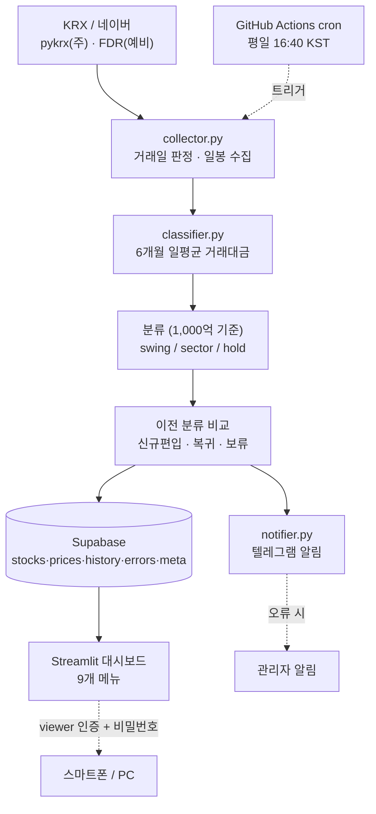
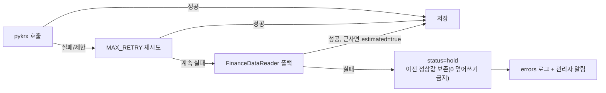

# ARCHITECTURE.md — 시스템 아키텍처

## 1. 추천 기술 스택

| 레이어 | 선택 | 비고 |
|---|---|---|
| 언어 | Python 3.11 | 수집·계산·대시보드 단일 언어 |
| 데이터 수집 | **pykrx**(주) / **FinanceDataReader**(예비) | KRX 기반 실거래대금 제공, 무료, 키 불필요 |
| 데이터 저장 | **Supabase(PostgreSQL)** 무료 티어 | 다기기 접속·영구 시계열 |
| 대시보드 | **Streamlit** + Streamlit Community Cloud | 모바일/PC 반응형, GitHub 연동 자동 배포 |
| 자동 실행 | **GitHub Actions** cron | 평일 16:40 KST, 무료 |
| 알림 | **텔레그램 봇** (discord/email 교체 가능) | 무료·즉시 푸시 |
| 인증 | 앱 비밀번호 + Streamlit viewer allow-list | 개인 비공개 |
| 비밀키 | 환경변수 / 플랫폼 Secrets | 코드 하드코딩 금지 |
| 월 비용 | **0원** (무료 티어 내) | 확장 시 Supabase Pro $25~ |

핵심 설계: **수집(GitHub Actions) ↔ 표시(Streamlit) 분리.**
대시보드가 슬립해도 데이터 갱신은 멈추지 않는다.

## 2. 데이터 수집 구조

```
collector.py
 ├─ latest_trading_day()      거래일 판정 (pykrx 영업일 → FDR 폴백)
 ├─ fetch_stock(code…)        종목별 6개월 일봉, 주→예비 폴백, MAX_RETRY 재시도
 │   ├─ _fetch_pykrx()        OHLCV+거래대금 직접
 │   └─ _fetch_fdr()          예비; 거래대금 없으면 종가×거래량 근사 + estimated=True
 └─ collect_all(stocks)       한국 종목 전체, 실패는 status="hold"(예외 던지지 않음)
```
원칙: 실패해도 예외로 중단하지 않고 hold 반환 → 파이프라인 지속. 0원 덮어쓰기 금지.

## 3. 데이터베이스 구조

Supabase 5개 테이블 (상세는 `DATA_MODEL.md`):
- `stocks` — 종목별 현재 상태(분류·평균·표시값) 1행
- `prices` — 일별 시세 시계열, (code,date) 유니크 upsert
- `history` — 분류 변경 이력
- `errors` — 오류 로그
- `meta` — 마지막 업데이트 시각 등 key-value

## 4. 웹 대시보드 구조

Streamlit `dashboard/app.py`, Supabase에서 읽기 전용.
9개 메뉴: 전체 / 단기스윙 / 섹터별 / 신규편입 / 섹터복귀 / 거래대금순위 / 변경이력 / 확인보류 / 마지막최신화시각(상단 고정).
기능: 종목명·코드 검색, KOSPI/KOSDAQ 필터, 섹터 필터, 거래대금순 정렬, 신규편입만 보기, CSV 다운로드, 모바일 대응, 비밀번호 게이트.

## 5. 자동 실행 구조

`.github/workflows/daily-update.yml`
- `schedule: cron "40 7 * * 1-5"` (평일 UTC 07:40 = KST 16:40)
- `workflow_dispatch` 수동 실행
- Secrets에서 환경변수 주입 → `python scripts/run_daily_update.py`
- 휴장일이면 스크립트가 거래일 판정 후 자체 스킵

## 6. 텔레그램 알림 구조

`notifier.py` — `send(text)`가 `NOTIFY_CHANNEL`(telegram/discord/email/none)로 분기.
메시지 빌더 3종: 일일요약 / 변경없음(요약에 통합) / 오류.
전송 실패는 False 반환(예외 전파 안 함).

## 7. 인증 구조

- 1차: Streamlit Community Cloud **viewer 이메일 allow-list** (비공개 저장소 무료 지원)
- 2차: 앱 내 `APP_PASSWORD` 게이트(환경변수, 비우면 생략)
- 저장소 private, 모든 키는 Secrets

## 8. 배포 구조

| 대상 | 위치 | 비밀키 |
|---|---|---|
| 수집·스케줄 | GitHub Actions | GitHub Secrets |
| 저장소(DB) | Supabase | Supabase 대시보드 |
| 대시보드 | Streamlit Cloud | Streamlit Secrets |
| 알림 | 텔레그램 | GitHub Secrets |

## 9. 시스템 구성도



## 10. 주 데이터 소스 장애 시 대체 흐름



데이터 소스 비교표는 `README_HANDOFF.md` 참고.
